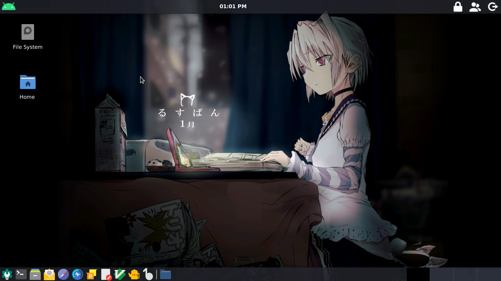
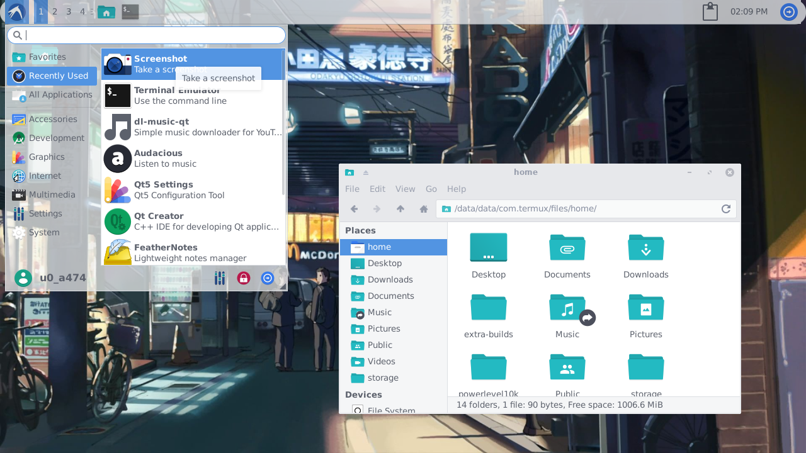
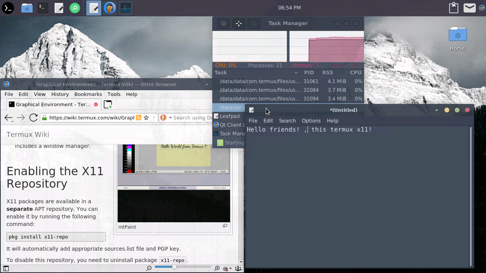
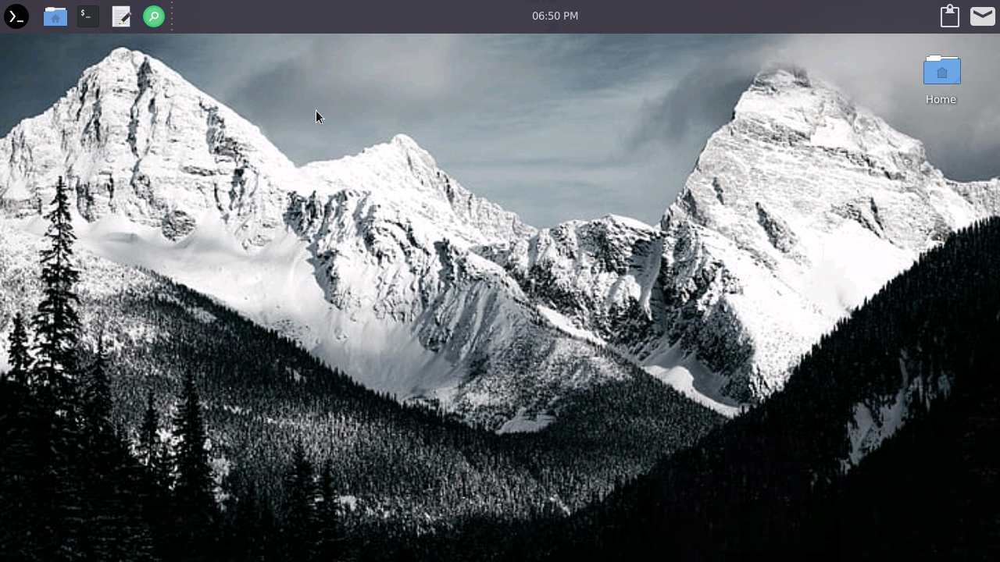
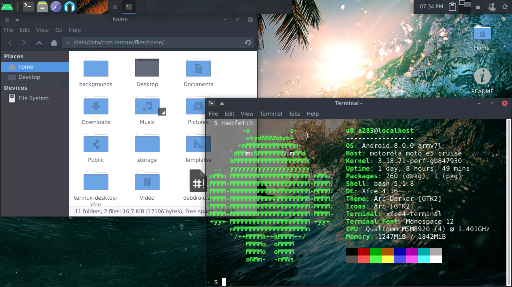
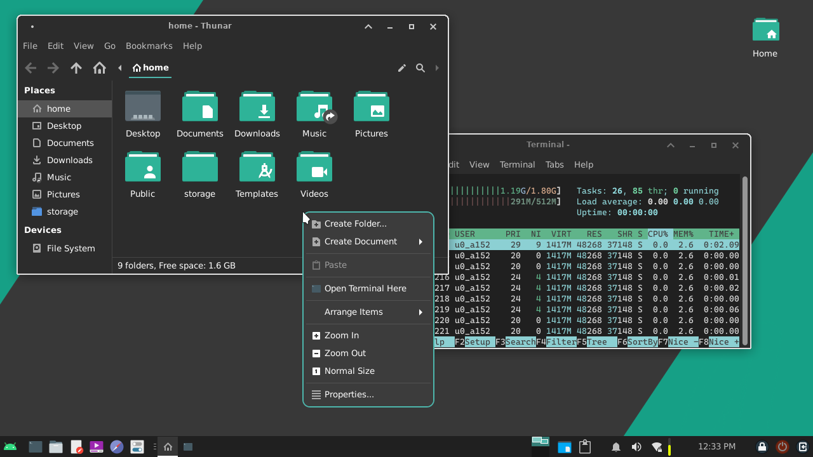
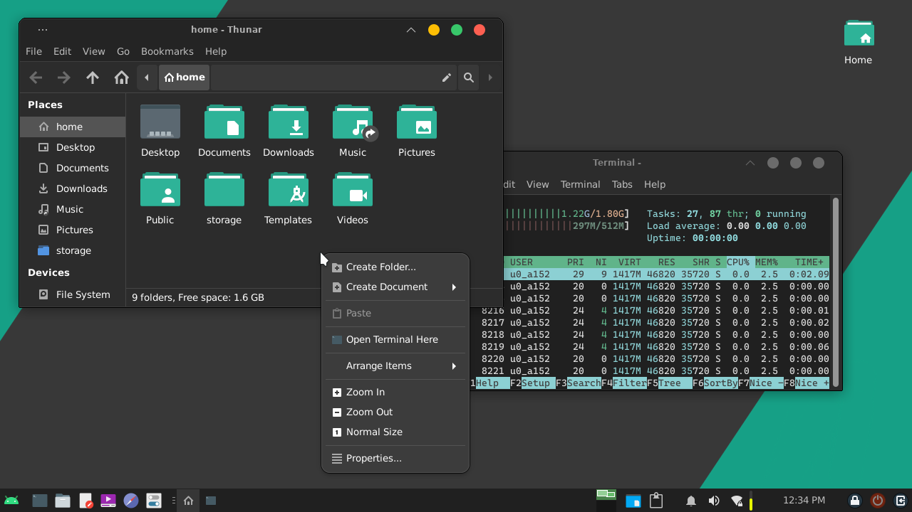
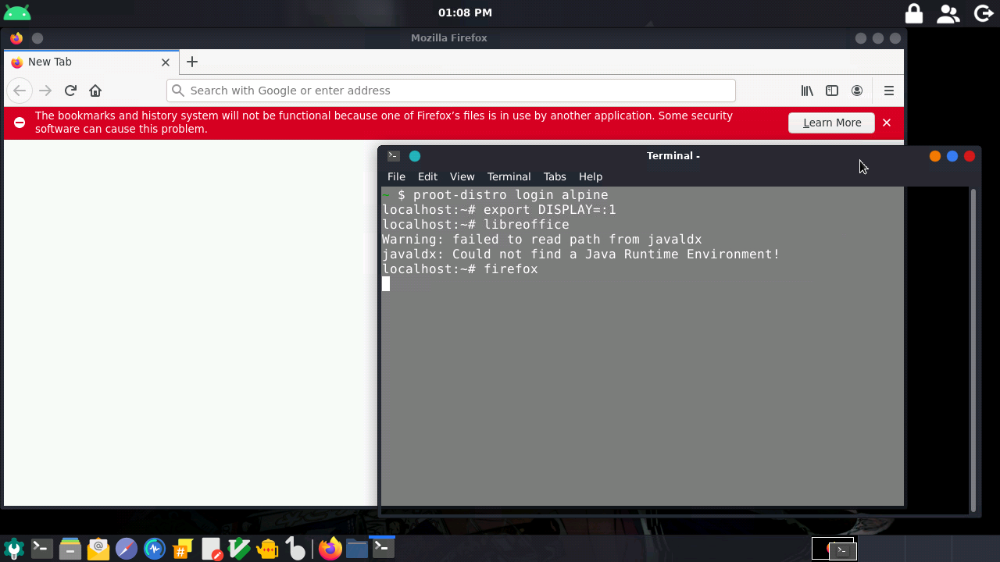
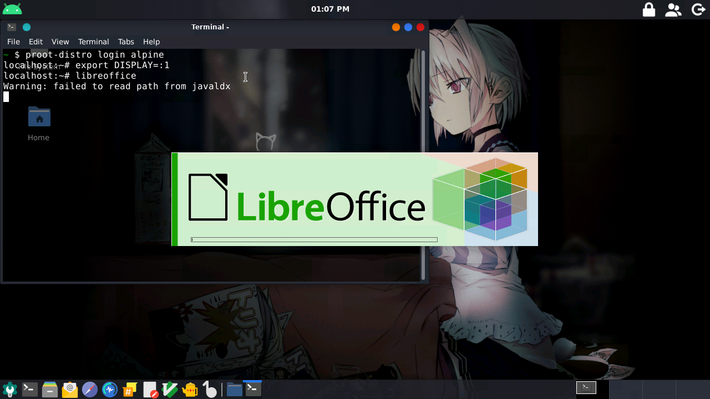
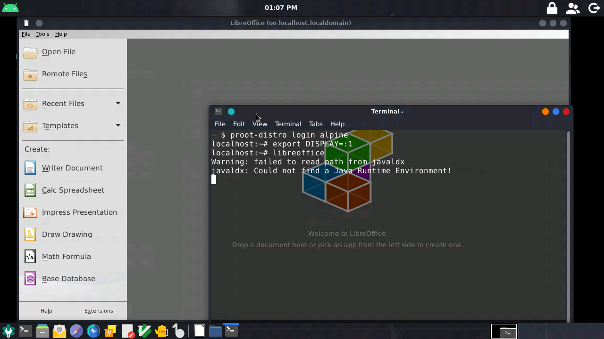

# termux-desktop-xfce
Set up a beautiful xfce desktop in termux 

## Requirements

- No root permission is required to make this work
- an Android 7+ phone
- [Termux (F-Droid)](https://f-droid.org/en/packages/com.termux/)
> Termux from Google Play is unmaintained due to API requirements, use the F-Droid one instead.
- 1GB of RAM (minimum) 2GB of RAM (recommended)
- [VNC Client](https://play.google.com/store/apps/details?id=com.realvnc.viewer.android)

> NOTE: You can also use xserver-xsdl, bvnc pro or kali-Kex

# What is this?

This is an advanced configuration of termux x11, rich in features to be highly functional, 
good looking, highly customizable and with very good optimization, this was inspired by @Manjaro [manjaro-site](https://manjaro.org) and from @adi1090x 's [termux-desktop](https://github.com/adi1090x/termux-desktop) , resulting in a highly useful and optimized desktop. 

# Screenshots:

> Current version of this project: v5.0.3








# Themes

Aside from the screenshots above, there are many
more themes you can change from settings.
There's tons of wallpapers too!




### Less apps ?, I have made a configuration to run the apps of a proot distro in termux native desktop. An example:

```
./start-ubuntu.sh
apt install firefox
export DISPLAY=:1
firefox 
```

### You can run proot apps without problems

 
 
 

# Installation

> NOTE: This only works on Termux. Do not try it on other linux terminal emulators.

```bash
curl -sLf https://raw.githubusercontent.com/Yisus7u7/termux-desktop-xfce/main/boostrap.sh | bash
```

After that just have a cup of coffee... the script will do its job 

# Usage
Run:
> Inside a proot-distro
```bash
vncserver -listen tcp 
```
> No proot-distro
```bash
vncserver
```

# Some documentation
If you're trying to launch an x application inside proot-distro and already did `export DISPLAY=:1` but gives you an error that says 
`Unable to init server: Could not connect: Connection refused
`
, then login to proot-distro with
```
proot-distro login ubuntu --user (yourname) --shared-tmp
```
`(yourname)` would be something like `root` or your sudo name.

# Starting XFCE
To start the vnc server, connect to localhost: 1 Or the port indicated by the terminal.
Any error, question or suggestion, report it in:
https://github.com/Yisus7u7/termux-desktop-xfce/issues


I hope you like this little work, don't forget to leave your 🌟 and share: 3 

You can donate to this little project in PayPal

https://www.paypal.me/JesusChapman 
