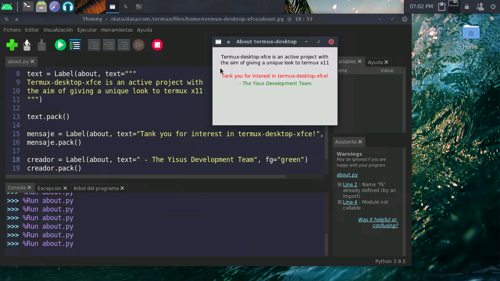

# termux-desktop-xfce
Set up a beautiful xfce desktop in termux 

## Requirements

`No need root permissions`

Android 7, 8, 9 o 10

Termux : https://f-droid.org/en/packages/com.termux/

1 GB of ram minimum, 2 GB recommended 

1 GB of space 

A vnc client with which to connect, you can use this

https://play.google.com/store/apps/details?id=com.realvnc.viewer.android

You can also use xserver-xsdl, bvnc pro and kali-Kex

> Note: the play store termux is unmaintained and does not receive updates, 
do not use it, it has bugs, use the one from the link above 

# What is it?

This is an advanced configuration of termux x11, rich in features to be highly functional, 
good looking, highly customizable and with very good optimization, this was inspired by

https://github.com/WMCB-Tech/dotfiles

and

https://github.com/adi1090x/termux-desktop

Resulting in a highly useful and optimized desktop. 

# screenshots:

> current version: 3.0.1 fresh update

> Note: This desktop runs under termux x11, it is not a proot distribution

# Take a look at the pre-installed utilities

### --process viewer and music player

### --surf the web, edit your files with Gvim, leafpad, and chat on irc channels with hexchat

 
 

### --program with good autocompletion and syntax highlighting with geany

### --Play retro games or run windows 1, 2 or 3 on dosbox emulator

> few apps ?, I have made a configuration to run the apps of a proot distro in termux x11! An example:

./start-ubuntu.sh

apt install firefox

export DISPLAY=:1

firefox 

### can run proot apps without problems

 
 
 

# instalaci�?n 

?? Only in termux

cd $HOME

pkg update && pkg upgrade 

pkg install git 

pkg install wget 

git clone https://github.com/Yisus7u7/termux-desktop-xfce

cd termux-desktop-xfce

bash install-desktop-xfce.sh

> after that just wait, the script will do its job 

# Use

use the command: 

startdesktop 

Or 

vncserver -listen tcp 

To start the vnc server, connect to localhost: 1 Or the port indicated by the terminal.

Any error, question or suggestion, report it in:
https://github.com/Yisus7u7/termux-desktop-xfce/issues

## Update 

To update just run

cd ~/termux-desktop-xfce 

git pull 

bash update-desktop.sh 

clever!

`note: if the folder does not exist or you deleted it to free up space then you should follow these steps:`

to update just run

cd $HOME

git clone https://github.com/Yisus7u7/termux-desktop-xfce

cd termux-desktop-xfce 

bash update-desktop.sh 

`I hope you like this little work, don't forget to leave your 🌟 and share: 3` 

You can donate to this little project in PayPal

https://www.paypal.me/JesusChapman 

Will be appreciated 😉
