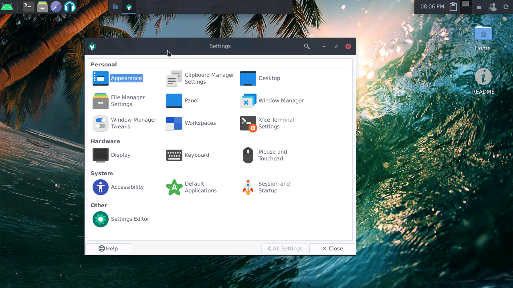
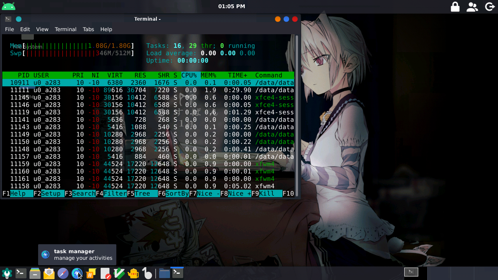
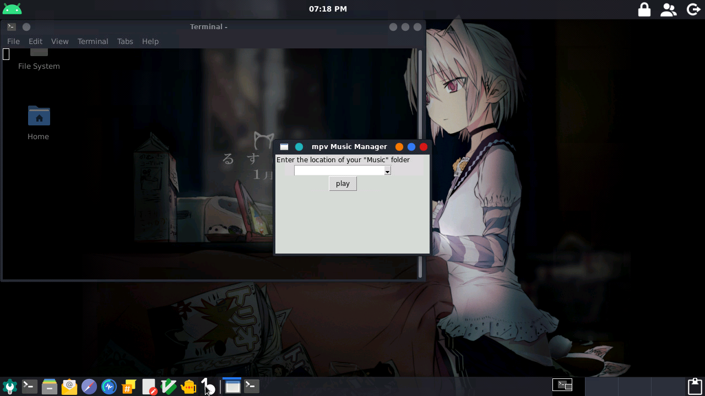
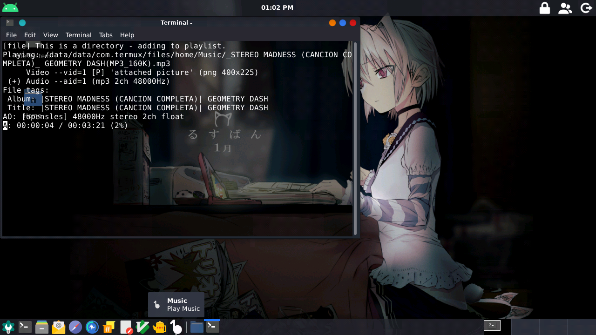
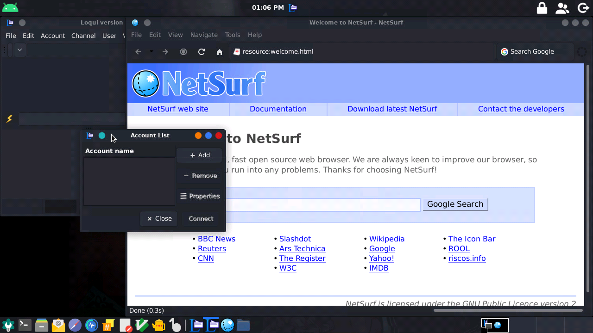
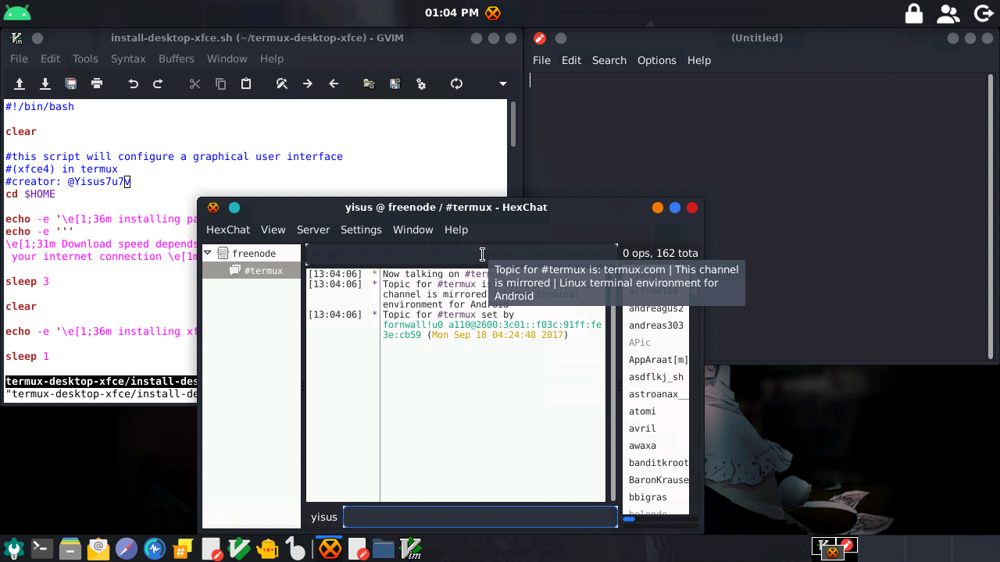
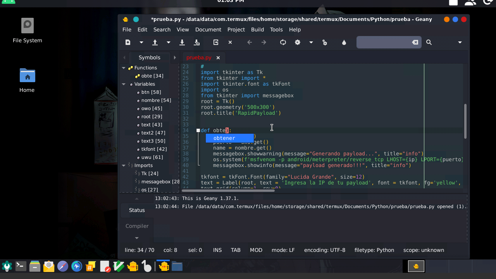
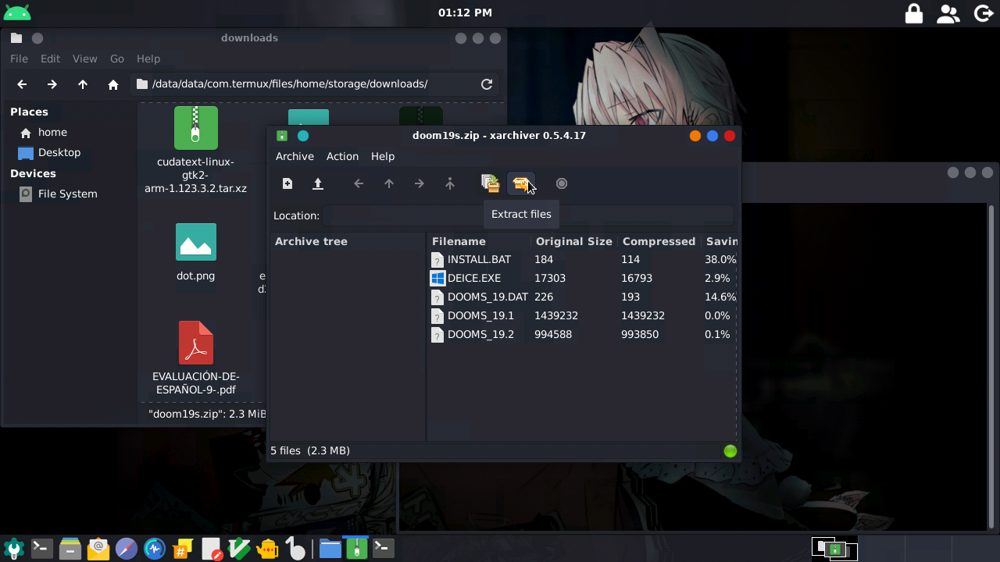
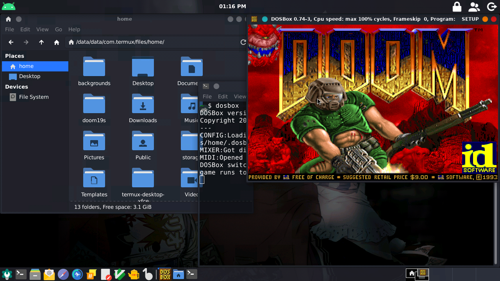
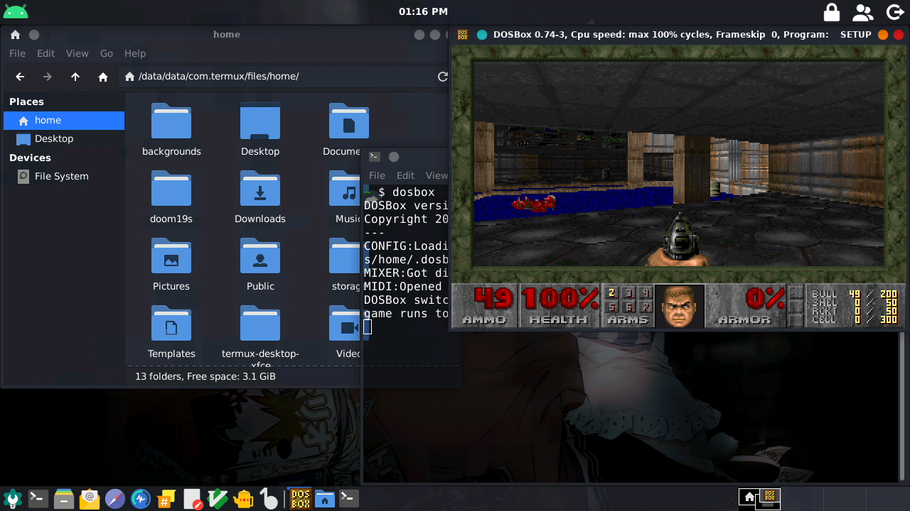

# termux-desktop-xfce
Set up a beautiful xfce desktop in termux 

README in English:

https://github.com/Yisus7u7/termux-desktop-xfce/blob/main/README-en.md

## Requisitos 

`No Necesita permisos root`

Android 7, 8, 9, 10, 11 o 12

Termux : https://f-droid.org/en/packages/com.termux/

1 GB de ram mínimo, 2 GB recomendado 

1 GB de espacio 

Un cliente vnc con el cual conectarse, 
Puedes usar este :

https://play.google.com/store/apps/details?id=com.realvnc.viewer.android

También puedes usar xserver-xsdl, bvnc pro y 
kali-Kex

> Nota : el termux de la play store es desmantenido 
y no resive actualizaciones, no lo uses, tiene 
bugs, usa el del enlace que deje arriba 

# Que es? 

Esto es una configuración avanzada de termux x11, 
rica en funciones para ser altamente funcional,
con un aspecto atractivo, altamente personalizable
y con una optimización muy buena, esto fue 
inspirado en :

https://github.com/WMCB-Tech/dotfiles

Y

https://github.com/adi1090x/termux-desktop

Haciendo como resultado un escritorio altamente
útil y optimizado. 

# capturas de pantalla :

> versión actual : 3.0.9 Nord update


> Nota: Las siguientes imágenes son de versiones antiguas del proyecto




> Nota: Este escritorio se ejecuta bajo termux 
x11, no es una distribución proot

# Eche un vistazo a las utilidades preinstaladas

### --visor de procesos y reproductor de música





### --navegue en la web, edite sus archivos con Gvim,
### leafpad, y chatee en canales irc con hexchat

 
 

### --programe con un buen autocompletado y resaltado de sintaxis con geany



### --Juege juegos retro o ejecute windows 1, 2 o 3
### en el emulador dosbox






> pocas apps?, he echo una configuración para 
> ejecutar las apps de una distro proot en termux x11! 
> Un ejemplo :

```
./start-ubuntu.sh

apt install firefox

export DISPLAY=:1

firefox 
```

### puede ejecutar apps proot sin problemas

 
 
 

# instalación 

⚠ Solo en termux 

```bash
cd $HOME
pkg update && pkg upgrade 
pkg install git wget python
pip install colorama
git clone https://github.com/Yisus7u7/termux-desktop-xfce
cd termux-desktop-xfce
python install-desktop-xfce.py

# opcional, pero recomendado

bash get-qt5ct.sh
```

> luego de eso solo espere, el script hará su trabajo 

# Uso 

usa el comando :

```
startdesktop 

O este:

vncserver -listen tcp 
```

Pará iniciar el servidor vnc, conectese a localhost:1
O el puerto que haya indicado la terminal 

Cualquier error, pregunta o sujerencia reportala en :
https://github.com/Yisus7u7/termux-desktop-xfce/issues

## Actualizar 

Para actualizar solo es ejecutar :

```
cd ~/termux-desktop-xfce 
git pull 
bash update-desktop.sh 
```

Listo! 

nota: si la carpeta no existe o usted la eliminó 
para liberar espacio entonces debe seguir estos 
pasos:

para actualizar solo ejecute :

```
cd $HOME
git clone https://github.com/Yisus7u7/termux-desktop-xfce
cd termux-desktop-xfce 
bash update-desktop.sh 
```

`Espero que te guste este pequeño trabajo,
No olvides dejar tu 🌟 y compartir :3`

Puedes donar a este pequeño proyecto en paypal

https://www.paypal.me/JesusChapman 

Se agradecerá 😉
