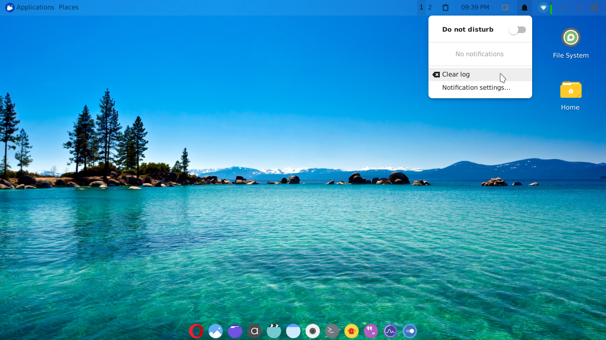
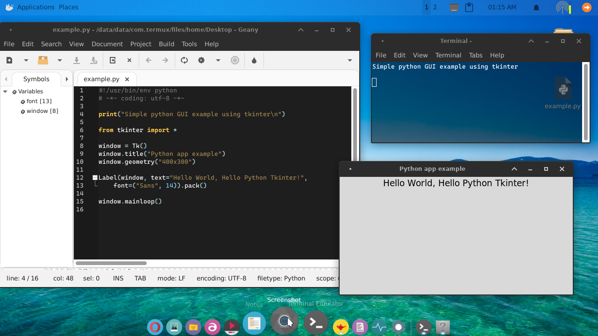
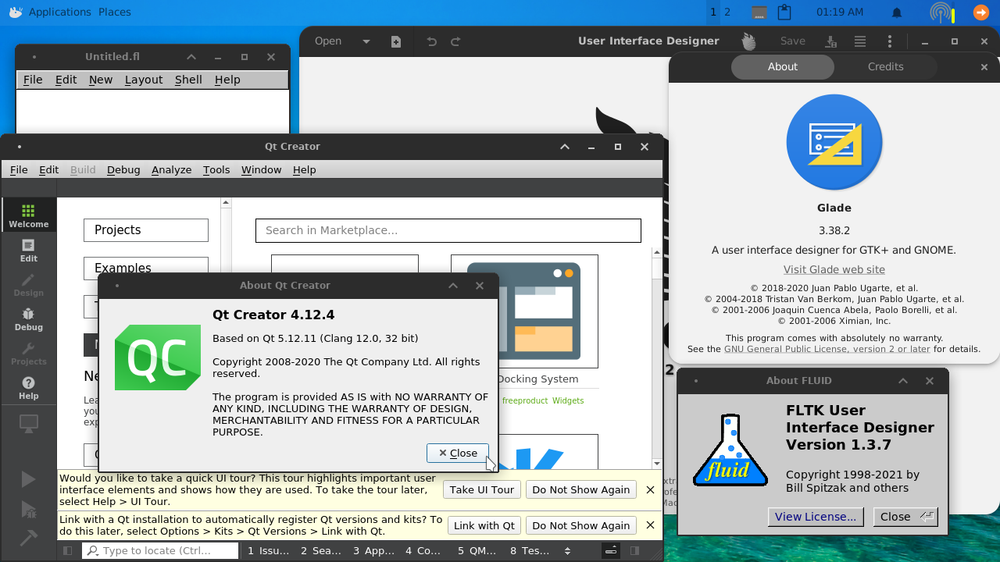
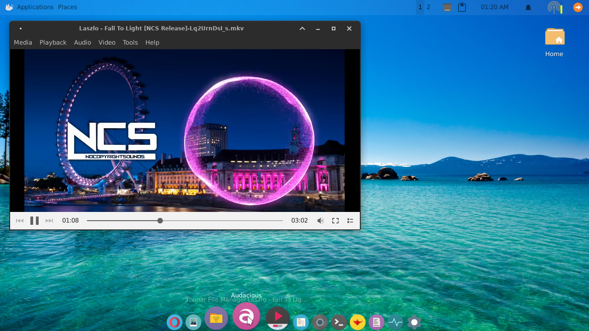
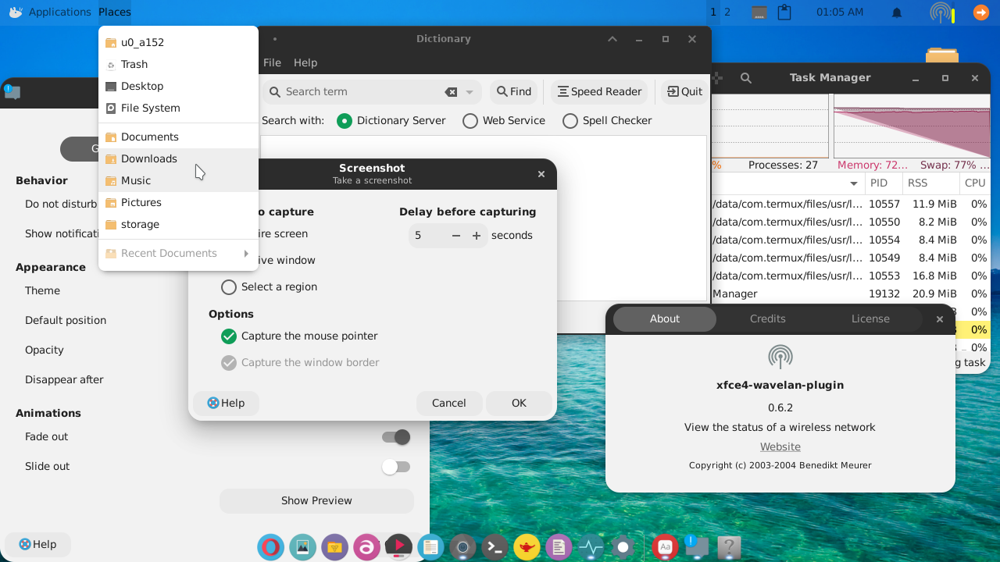
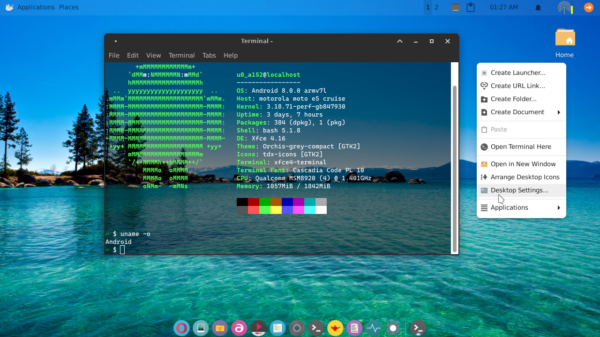
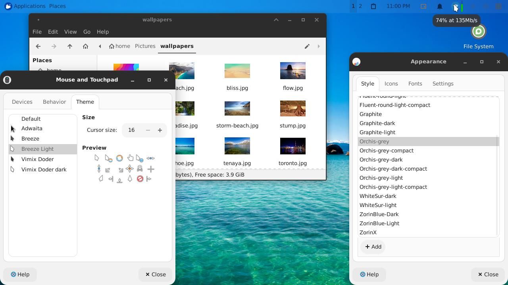

# Termux-desktop-xfce

# Aviso de la próxima actualización: 
# 5.0.1 (Modern Update)

### Que hay de nuevo en esta actualización¿?

- Interfáz moderna, limpia, y útil.
- Más facilidad de uso
- Cómodo para el usuario 
- Menos cosas innecesarias
- Totalmente útil para programadores y pentesters

# Características

- **IDE pre-configurado:**
Use el mini entorno de desarrollo integrado geany para programar, compilar y 
ejecutar diversos programas.

Con geany podrá programar en diversos lenguajes (entre ellos python, lua, C++/C,
 Java, R-lang, Rust y muchos otros más), disfrute de su autocompletado pre-configurado
Y hermoso tema oscuro .

También podrá disfrutar de programas como glade, idle, thonny, fluid, QtCreator
Y muchos otros más!

- **Multimedia:**
Disfrute la reproducción de música y videos en una calidad muy buena, con parole,
audacious o mpv-x (mpv-x puede reproducir videos de Youtube sin anuncios)

- **Moderno:**
Disfrute de una interfáz limpia, con la mayoría de complementos y servicios de xfce4
instalados, y el hermoso Cairo-Dock en el escritorio.

- **Nativo:**
Todo se ejecuta de forma 100% nativa en su celular Android, sin emular componentes,
cómo resultado tendrá un escritorio más rápido y con menos consumo de recursos

- **Personalización:**

Esta actualización vendrá con una gran cantidad de hermosos fondos de pantalla prenstalados,
así como un conjunto de temas gtk/kvantum/iconos ligeros para todos los gustos.

> estas son solo algunas de sus muchísimas características y usos.

# Estado actual

**Progreso en desarrollo, no terminado. vea:**

- https://github.com/termux/x11-packages/pull/504
- https://github.com/termux/x11-packages/pull/503
- Falta agregar Cairo dock a los repositorios de termux

# Créditos

- Temas de iconos, gtk, Qt creados por: 
- Este actualización fue inspirada en el proyecto 
- Configuración de geany por [@Wayn0](https://github.com/Wayn0/geany-dark-scheme)

# Contribuir

Si usted desea contribuir con integración de apps mejoras gráficas, alguna utilidad
creada por usted que quiera que se integre a este proyecto, contácteme :

https://t.me/Yisus7u7v

O si simplemente usted quiere donar, se lo agradecería mucho, esto me motivaria más
para el desarrollado de este proyecto y se lo agradecería mucho.

https://paypal.me/JesusChapman

Si desea darme una sugerencia o hacerme preguntas también puede [Contactarme](https://t.me/Yisus7u7v)

